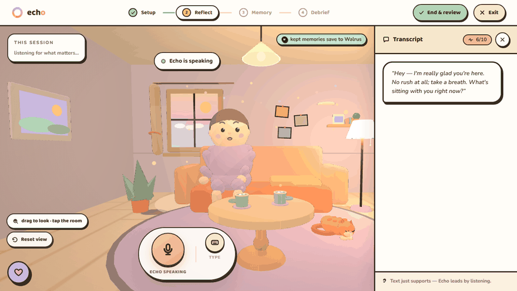
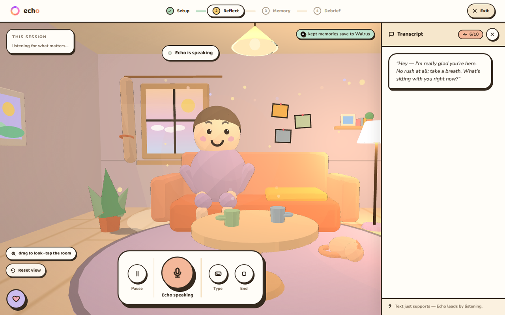
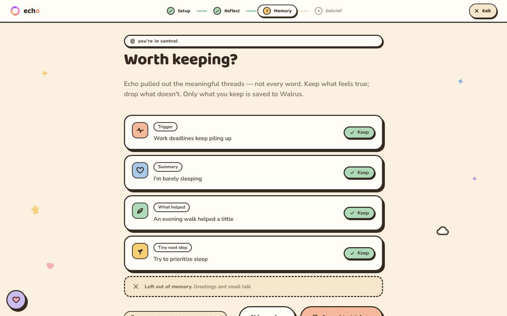
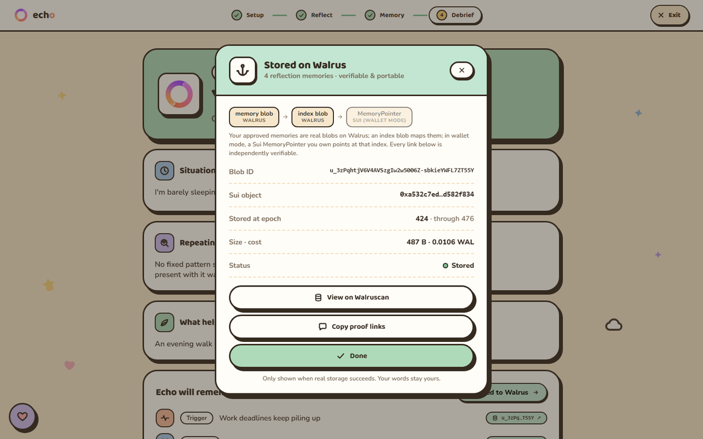
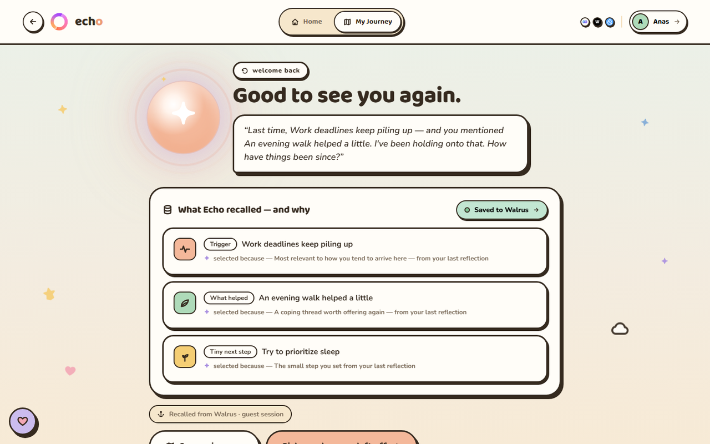
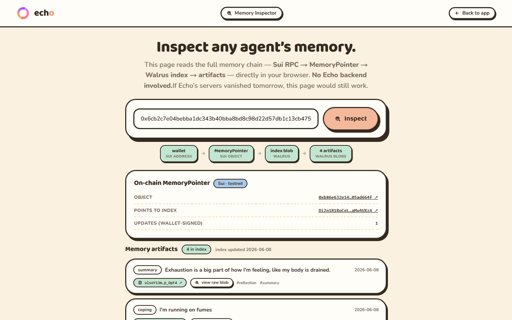
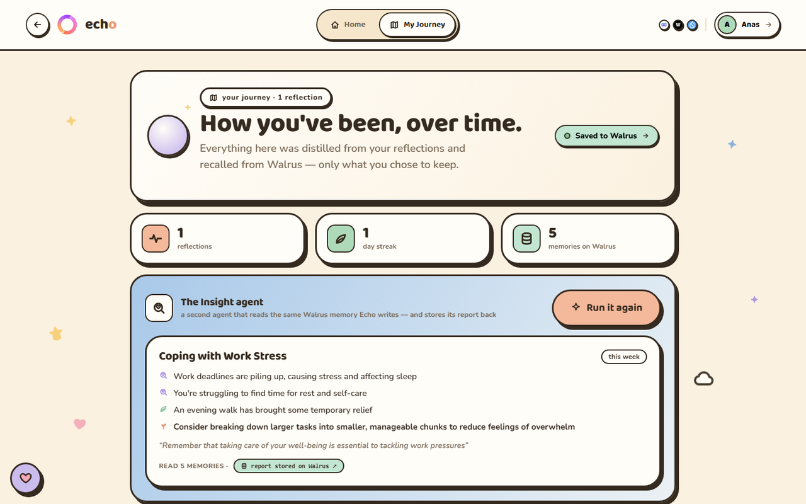
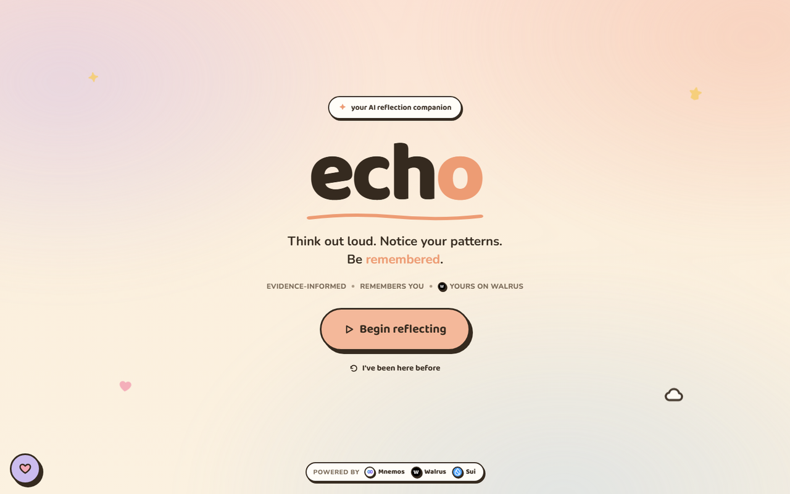
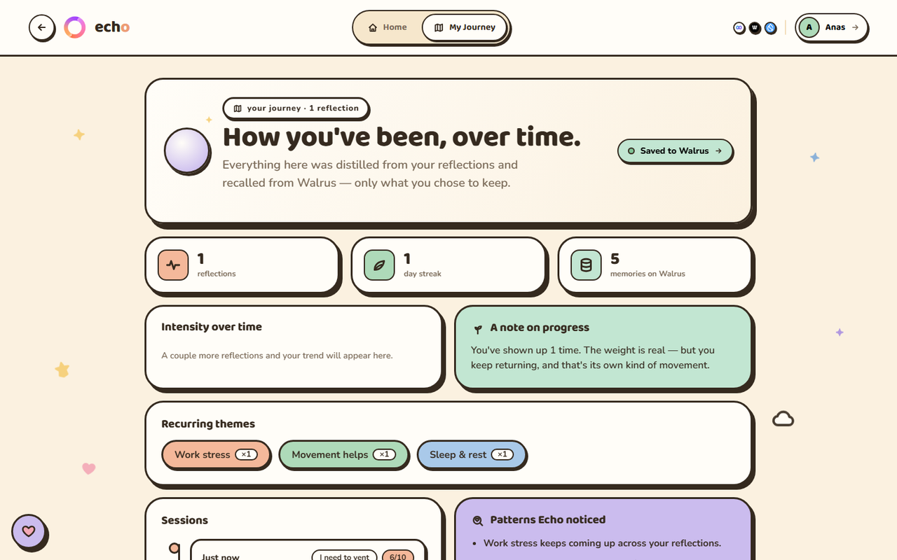

<div align="center">


# Echo

### Talk today. Understand tomorrow.

**An evidence-informed emotional reflection companion that remembers what matters — durable memory on [Walrus](https://walrus.xyz), wallet-owned memory pointers on [Sui](https://sui.io).**

[](https://echoai-app.vercel.app)
&nbsp;
[](https://github.com/i-anasop/echo)

[](https://github.com/i-anasop/echo/actions/workflows/ci.yml)
[](https://sui.io)
[](https://walrus.xyz)
[](https://nextjs.org)
[](https://typescriptlang.org)
[](#10-sui-move-contract--memoryregistry)

</div>

---

> ### For judges — Echo in 30 seconds
>
> AI agents are **stateless** — they forget everything between sessions, and their memory is locked inside whatever app they run in. Echo proves the alternative: an AI reflection companion whose memory lives on **Mnemos**, a verifiable agent-memory layer built on **Walrus + Sui**. Approved memories are durable Walrus blobs; a **wallet-signed Sui MemoryPointer** always references the latest memory index; a **second agent** reads the same shared memory and writes artifacts back; and **anyone can inspect or recover the memory with zero Echo backend** — if Echo's servers vanished tomorrow, your memories wouldn't.
>
> | | |
> |---|---|
> | **What** | Echo — an emotional-reflection **agent** with persistent, user-owned memory (the flagship app on the **Mnemos** memory layer) |
> | **Walrus** | Every approved memory artifact + the memory index + agent-generated reports live as verifiable blobs |
> | **Sui** | A wallet-owned `MemoryRegistry` pointer to the **latest** Walrus index blob — updated only by wallet-signed txs |
> | **Multi-agent** | The **Insight agent** reads the same Walrus memory Echo writes and stores its report back as a durable artifact |
> | **Tooling** | The **[Memory Inspector](https://echoai-app.vercel.app/inspect?address=0x6cb2c7e04bebba1dc343b40bba8bd8c98d22d57db1c13cb4751fd9eb144540ba)** — one click inspects a real demo wallet's memory, fully client-side (Sui RPC + Walrus aggregator, no backend) |
> | **Proof** | Each save returns Walrus blob IDs (Walruscan), the Sui tx digest, and the pointer object ID — [or verify by curl](#verify-it-with-curl--no-echo-backend-involved) |
> | **Honest scope** | A reflection & journaling aid — **not** therapy, diagnosis, or a crisis service |

---

<div align="center">

<br/><em>The reflection room, alive: hands-free voice, a talking companion, a flickering hearth — drag to look around, tap the room to play. (More <a href="#screenshots">screenshots</a> below.)</em>
</div>

---

## Table of contents

1. [What is Echo](#1-what-is-echo) · 2. [Problem](#2-problem) · 3. [Solution](#3-solution) · 4. [Why Walrus](#4-why-walrus) · 5. [Why Sui](#5-why-sui) · 6. [Architecture](#6-architecture) · 7. [User flow](#7-user-flow) · 8. [Demo & verification](#8-demo--verification-guide) · 9. [Tech stack](#9-tech-stack) · 10. [Sui Move contract](#10-sui-move-contract--memoryregistry) · 11. [Local development](#11-local-development) · 12. [Environment variables](#12-environment-variables) · 13. [Safety](#13-safety--responsible-ai) · 14. [Limitations](#14-limitations) · 15. [Roadmap](#15-roadmap) · 16. [Submission summary](#16-submission-summary)

---

## 1. What is Echo

Echo is a warm, voice-first companion that helps you **think out loud, notice your patterns, and take one small next step**. Each session runs a light, evidence-informed reflection loop (Situation → Feeling → Thought → Body → Action → Reframe → Next step) — and, crucially, **remembers what matters across sessions**.

Memory is powered by **[Mnemos](https://github.com/i-anasop/Mnemos)**, a reusable AI memory engine. Echo is the product layer; Mnemos is the substrate that makes durable, consent-gated, user-owned memory work.

> **Echo is an evidence-informed reflection companion, not medical care.** It does not diagnose, treat, or replace professional help. See [§13 Safety](#13-safety--responsible-ai).

---

## 2. Problem

- **AI companions forget you.** When the chat ends, your context is gone — so you re-explain your stressors and what helped, every single time.
- **Reflection loses its value without continuity.** The insight from last week only compounds if it's still there next week.
- **Sensitive memory shouldn't be locked in a black box.** Personal reflection data sitting inside a private database is neither portable nor verifiable, and the user can't truly own it.
- **People need continuity, transparency, and control** over what is remembered about them — especially for something this personal.

---

## 3. Solution

Echo turns memory from a hidden backend feature into a **verifiable, user-owned layer**:

1. **Reflect** through a calm, guided voice/text flow.
2. Echo **proposes meaningful memory candidates** — distilled artifacts (summary, trigger, pattern, what helped, next step), never raw transcripts.
3. **You review and approve** what gets kept. Nothing is saved until you say so.
4. Approved memories are written to **Walrus** as durable blobs.
5. Your **Sui wallet signs** a transaction that registers a pointer to the **latest Walrus memory index**.
6. **Return later** — Echo reads your pointer, restores the index from Walrus, and recalls your context with plain-English reasons.

**Without Walrus + Sui, Echo is just another temporary chatbot. With them, it's a persistent, user-owned memory experience.**

---

## 4. Why Walrus

**Walrus is load-bearing, not decorative — Echo's memory physically lives there.**

- Every **approved memory artifact** (summary, trigger, pattern, what-helped, next-step) is stored as a durable **Walrus blob** with a public `blob_id`.
- The user's **memory index** (the recall map) is also stored as a Walrus blob, so the entire memory state is reconstructable from Walrus alone.
- Each save returns a **proof** containing real blob IDs that anyone can open on **[Walruscan](https://walruscan.com)** — the memory is independently verifiable, not a claim.
- Recovery (`/api/memory/restore`) rebuilds a user's index **straight from a Walrus blob**, which is what makes memory portable across devices.

```
Reflection  →  Memory Review  →  Walrus Artifact Blobs  →  Walrus Index Blob
 (talk/type)   (approve only)     (one per memory)          (the recall map)
```

> Echo depends on Walrus for persistence. Remove Walrus and there is no durable, verifiable memory to point to.

---

## 5. Why Sui

**Sui gives the memory an owner and a single source of truth.**

- Your **Sui wallet is your identity** — memory is scoped to your address, never mixed with anyone else's.
- A tiny Move contract, **`MemoryRegistry`**, stores a user-owned **`MemoryPointer`** object holding the **latest** Walrus index blob id.
- The pointer is **created on your first save and updated on every later save**, each time via a **wallet-signed transaction** — so the on-chain pointer always reflects the newest memory state, and only you can move it.
- Because the pointer is on-chain and wallet-owned, Echo can **recover your memory on any browser or device**: read pointer → fetch index from Walrus → recall.
- The **proof card** surfaces the **Sui tx digest** and **pointer object id**, linkable on [Suiscan](https://suiscan.xyz).

```
Wallet  →  Sui MemoryRegistry (MemoryPointer)  →  latest Walrus index blob
 (signs)    (user-owned object)                   (→ all your memory blobs)
```

> Walrus makes memory **durable**; Sui makes it **owned and recoverable**. Together they make it **portable and verifiable**.

### Verify it with curl — no Echo backend involved

The whole memory chain is recoverable without Echo existing. These commands run against a **real demo wallet** — copy-paste them:

```bash
# 1) Wallet → MemoryPointer (straight from Sui RPC)
curl -s https://fullnode.testnet.sui.io -H 'Content-Type: application/json' -d '{
  "jsonrpc":"2.0","id":1,"method":"suix_getOwnedObjects",
  "params":["0x6cb2c7e04bebba1dc343b40bba8bd8c98d22d57db1c13cb4751fd9eb144540ba",
    {"filter":{"StructType":"0xec0f4d2bfb1eb7d8e4b5df2cd110f326301ace269b421188594ef8937bfb1715::memory_registry::MemoryPointer"},
     "options":{"showContent":true}},null,5]}'
# → content.fields.index_blob_id  (the latest Walrus memory index)

# 2) Pointer → memory index (straight from the Walrus aggregator)
curl -s https://aggregator.walrus-testnet.walrus.space/v1/blobs/Di2n1R1RoCeLgOVa0DubcKcDFHeS2t5NGz3aMu4UXzA
# → { "entries": [ { "blob_id": …, "summary": …, … } ] }

# 3) Index → any memory artifact
curl -s https://aggregator.walrus-testnet.walrus.space/v1/blobs/<any entries[].blob_id from step 2>
```

Prefer a UI? The **[Memory Inspector](https://echoai-app.vercel.app/inspect?address=0x6cb2c7e04bebba1dc343b40bba8bd8c98d22d57db1c13cb4751fd9eb144540ba)** does exactly these reads, client-side, with links to Suiscan/Walruscan for every hop.

---

## Built for the Walrus track — point by point

The track asks for agents with **persistent, verifiable memory**, **multi-agent / artifact-driven workflows**, and **tooling to inspect and manage agent memory on Walrus**. Echo + Mnemos answers each directly:

| Track ask | What Echo ships |
|---|---|
| Long-term agent memory, portable across sessions | Approved memories → Walrus blobs; index → Walrus; pointer → wallet-owned Sui object; recall restores **Sui → Walrus** on any device |
| Multi-agent coordination over shared context | The **Insight agent** reads the same Walrus memory Echo writes (two agents, one verifiable memory layer) |
| Artifact-driven workflows | Insight reports are **stored back to Walrus** as durable `insight_report` artifacts in the shared index |
| Tooling to inspect/debug/manage agent memory | The **[Memory Inspector](https://echoai-app.vercel.app/inspect)** — trustless, client-side memory explorer for any wallet |
| Not locked into a single platform | The `curl` proof above: full recovery with **zero Echo infrastructure** |
| Reusable beyond one app | **Mnemos** is the engine layer — the same memory substrate can back any agent (SDK on the roadmap) |
| Engagement with the Walrus stack | **[Mnemos × MemWal](docs/MEMWAL.md)**: architecture comparison + a specified `MemoryBackend` adapter; **Seal** encryption is the top roadmap item |

---

## 6. Architecture

```
                        ┌─────────────────────────┐
                        │           User          │
                        └────────────┬────────────┘
                                     │  voice / text
                        ┌────────────▼────────────┐
                        │   Echo UI (Next.js)     │   guided reflection flow
                        └────────────┬────────────┘
                                     │
                        ┌────────────▼────────────┐
                        │  Reflection Brain        │   POST /api/reflect
                        │  (Groq → Gemini → Anthr.)│   warm, memory-aware reply
                        └────────────┬────────────┘   + crisis-safety routing
                                     │  end session
                        ┌────────────▼────────────┐
                        │  Memory Proposal         │   POST /api/memory/propose
                        │  (distill candidates)    │   summary · trigger · pattern…
                        └────────────┬────────────┘
                                     │  user approves
                        ┌────────────▼────────────┐
                        │  Memory Review (consent) │   keep / skip — nothing saved yet
                        └────────────┬────────────┘
                                     │  commit (approved only)
                        ┌────────────▼────────────┐
                        │  Walrus Artifact Storage │   POST /api/memory/commit
                        │  (one blob per memory)   │   batched, parallel writes
                        └────────────┬────────────┘
                                     │
                        ┌────────────▼────────────┐
                        │  Walrus Index Blob       │   the durable recall map
                        └────────────┬────────────┘
                                     │  returns index_blob_id
                        ┌────────────▼────────────┐
                        │  Sui MemoryRegistry      │   wallet-signed create/update
                        │  Pointer (user-owned)    │   → latest index blob id
                        └────────────┬────────────┘
                                     │  days later…
                        ┌────────────▼────────────┐
                        │  Return & Recall         │   read pointer → restore from
                        │                          │   Walrus → "selected because…"
                        └─────────────────────────┘
```

**Major modules**

| Module | Where | Responsibility |
|---|---|---|
| Echo frontend | `app/`, `components/` | Guided reflection UI, companion orb, proof card, recall |
| Reflection API | `app/api/reflect` | One warm, memory-aware turn + crisis-safety routing |
| Memory proposal | `app/api/memory/propose` · `lib/echo/extractor.ts` | Distill approved-only candidate artifacts from a transcript |
| Walrus commit | `app/api/memory/commit` · `lib/walrus/` | Batched parallel blob writes + flush the index blob + proof |
| Sui registry | `lib/sui/registry.ts` · `move/memory_registry` | Build/sign the `create`/`update` pointer transaction |
| Recall system | `app/api/recall` · `app/api/memory/restore` · `lib/echo/recall.ts` | Restore index from Walrus + relevance with reasons |
| Mnemos engine | `lib/walrus`, `lib/embeddings`, `lib/llm`, `components/identity` | Reusable memory substrate (storage, index, identity, consent) |

---

## 7. User flow

1. User opens Echo (returning users land straight on Home).
2. Chooses **Guest** or **Sui wallet** identity.
3. Selects a **reflection mode** (check-in · vent · understand · reset · weekly · continue).
4. **Talks or types** through a calm, immersive session.
5. Echo **proposes** meaningful memory candidates.
6. User **reviews** the candidates — keep what's true, skip the rest.
7. Echo **stores approved memories on Walrus**.
8. **Wallet signs** the Sui pointer update (wallet mode).
9. A **proof card** appears (Walrus blob IDs, Sui tx digest, pointer object id, index blob id).
10. Later, the user **returns** and Echo **restores context** from the pointer → Walrus.

---

## 8. Demo & verification guide

**Live app → [echoai-app.vercel.app](https://echoai-app.vercel.app)**

> Voice works best in **Chrome / Edge**. Wallet mode needs a Sui wallet on **testnet** with a little gas — fund your address at the [Sui testnet faucet](https://faucet.sui.io).

**Steps**

1. Open the live URL.
2. Onboard and **connect your Sui wallet** (testnet).
3. Pick a mode → reflect a few lines → **End**.
4. In **Memory review**, keep 2–3 memories → **Save to Walrus**.
5. **Approve the Sui transaction** in your wallet.
6. Open the **proof card** (Debrief → "Walrus + Sui proof").
7. Verify each artifact:

| Proof field | What it is | Verify on |
|---|---|---|
| **Walrus blob ID** | the stored memory artifact | [Walruscan](https://walruscan.com) → `…/testnet/blob/<id>` |
| **Walruscan link** | one-click blob view | opens from the card |
| **Sui tx digest** | the pointer create/update tx | [Suiscan](https://suiscan.xyz) → `…/testnet/tx/<digest>` |
| **Sui pointer object id** | your user-owned `MemoryPointer` | `…/testnet/object/<id>` |
| **Latest index blob id** | Walrus blob the pointer references | Walruscan |

8. **Test recovery:** refresh, or open the app in **another browser**, connect the same wallet → **Return & recall** restores your memory from the Sui pointer → Walrus.

> **Guest mode** works without a wallet (best-effort, session/local), so judges can see the full flow even without testnet gas — but the durable, recoverable path is **wallet mode**.

---

## 9. Tech stack

| Layer | Technology |
|---|---|
| Framework | **Next.js 16** (App Router, Turbopack), React 19 |
| Language | **TypeScript** (strict) |
| Styling | Tailwind v4 · Baloo 2 / Nunito |
| State | Zustand (persisted prefs/identity) |
| Identity & chain | **Sui** via `@mysten/dapp-kit` + `@mysten/sui` |
| Smart contract | **Sui Move** (`memory_registry`) |
| Storage | **Walrus** testnet (publisher/aggregator REST) |
| Memory engine | **Mnemos** (adapted) |
| Embeddings | **Voyage** (optional — enables semantic recall) |
| LLM | **Groq → Gemini → Anthropic** (pluggable fallback) |
| Voice | Web Speech API (STT + TTS) with graceful fallbacks |
| Hosting | **Vercel** |

---

## 10. Sui Move contract — `MemoryRegistry`

A tiny, user-owned pointer to the latest Walrus memory index blob. Deployed on **Sui testnet**.

| | |
|---|---|
| **Package ID** | [`0xec0f4d2bfb1eb7d8e4b5df2cd110f326301ace269b421188594ef8937bfb1715`](https://suiscan.xyz/testnet/object/0xec0f4d2bfb1eb7d8e4b5df2cd110f326301ace269b421188594ef8937bfb1715) |
| **Publish tx** | [`DMBQFE9EzFYwzGGPsT8SwDvZKw4a4MRTRjmuYYGSLAwy`](https://suiscan.xyz/testnet/tx/DMBQFE9EzFYwzGGPsT8SwDvZKw4a4MRTRjmuYYGSLAwy) |
| **Module** | `echo::memory_registry` |
| **Source** | [`move/memory_registry/sources/memory_registry.move`](move/memory_registry/sources/memory_registry.move) |

```move
/// A user-owned pointer to the latest Walrus memory index blob.
public struct MemoryPointer has key, store {
    id: UID,
    index_blob_id: String, // Walrus blob id of the user's latest memory index
    updates: u64,          // bumped on every commit (1 on create)
}

public fun create(index_blob_id: String, ctx: &mut TxContext) { /* first save → transfer to caller */ }
public fun update(pointer: &mut MemoryPointer, index_blob_id: String) { /* later saves → repoint + bump */ }
```

- **`create`** — first save: mints the pointer and transfers it to the wallet (the user owns it).
- **`update`** — later saves: overwrites `index_blob_id` to the newest Walrus index and bumps `updates`.
- The object is **owned by the wallet** — Echo's backend never holds it; only the user can move it.
- The client (`lib/sui/registry.ts`) reads the pointer via `getOwnedObjects` and builds a `create`/`update` transaction the wallet signs.

---

## 11. Local development

```bash
git clone https://github.com/i-anasop/echo.git
cd echo
npm install
cp .env.local.example .env.local      # then fill in keys (see §12)
npm run dev                           # http://localhost:3000

npm run typecheck                     # TypeScript (strict)
npm run build                         # production build
```

Use **Chrome or Edge** for real voice. The app runs in **guest mode** with just an LLM key; wallet + on-chain pointer needs the Sui env vars set.

> `.env.local` is **gitignored** and never committed. Real keys are never exposed to the browser.

---

## 12. Environment variables

**Public (inlined into the client at build time):**

| Variable | Purpose |
|---|---|
| `NEXT_PUBLIC_ECHO_PACKAGE_ID` | Sui `MemoryRegistry` package id (enables the on-chain pointer) |
| `NEXT_PUBLIC_SUI_NETWORK` | `testnet` (default) |

**Private (server-side only):**

| Variable | Required | Purpose |
|---|---|---|
| `GROQ_API_KEY` | ✅ (free) | Primary LLM |
| `GEMINI_API_KEY` | optional | Fallback LLM |
| `ANTHROPIC_API_KEY` | optional | Fallback LLM |
| `VOYAGE_API_KEY` | optional | Embeddings → semantic recall |
| `WALRUS_PUBLISHER_URL` | defaults to testnet | Walrus blob writes |
| `WALRUS_AGGREGATOR_URL` | defaults to testnet | Walrus blob reads |
| `WALRUS_NETWORK` | informational | `testnet` (network is set by the URLs above) |

**LLM priority:** Groq → Gemini → Anthropic. Only one is required.

---

## 13. Safety / Responsible AI

- Echo is **not a therapist** and does **not diagnose** or provide treatment.
- It is for **reflection, journaling, and emotional self-awareness** — it does not replace professional help.
- Echo is **not a crisis service.** Crisis signals (self-harm, harm to others, abuse, or requests for diagnosis/treatment) route to a gentle response that points to **emergency and professional support** — and that content is **never stored as memory**.
- **Memory is consent-gated:** nothing is saved until the user reviews and approves it. Only distilled artifacts are kept — never raw transcripts.
- No clinical language anywhere: the vocabulary is reflection, check-in, grounding, and a small next step.

---

## 14. Limitations

- **Testnet only.** Walrus + the Sui `MemoryRegistry` run on testnet; blobs are public and epoch-bound.
- **Guest mode is best-effort** (session/local) — durable, recoverable memory requires **wallet mode**.
- **Voice depends on the browser** (best in Chrome/Edge); elsewhere it degrades to typing.
- **Not medical care** — by design (see §13).
- **Privacy controls are early** — memory deletion/export and finer-grained controls are on the roadmap.

---

## 15. Roadmap

- [ ] **[Seal](https://github.com/MystenLabs/seal) encryption** — encrypt memory blobs with a wallet-derived key so memory is publicly *available* but privately *readable* (top priority; today's testnet blobs are public demo data, stated plainly at consent)
- [ ] **MemWal adapter** — let Mnemos use [MemWal (Walrus Memory)](https://github.com/MystenLabs/MemWal) as a pluggable backend — see **[docs/MEMWAL.md](docs/MEMWAL.md)** for the full comparison + adapter design (interface specified, honestly sequenced post-submission)
- [ ] **Walrus Quilt** batching for small artifacts (Echo stores many tiny blobs — Quilt is the natural storage optimization)
- [ ] Memory **deletion & export** (user-initiated)
- [ ] **Mainnet** deployment (Move package + Walrus mainnet)
- [ ] **Mnemos SDK** so any agent framework can adopt the Walrus + Sui memory layer

---

## 16. Sustainability — built to last

- **Storage economics:** a user's memory footprint is tiny — distilled artifacts of a few hundred bytes each. On Walrus that is **fractions of a cent per user per epoch**, paid in WAL; durable memory is economically boring in the best way.
- **Model:** the reflective core stays free. Premium tiers carry the costs they create — longer memory horizons, the encrypted tier (Seal), and richer Insight-agent reports. The deeper play is **Mnemos as an SDK**: any agent developer who wants verifiable, user-owned memory on Walrus + Sui is a customer.
- **Mainnet:** the Move package publish is a one-command step planned post-submission; Walrus mainnet storage follows with the WAL budget.
- **Engineering:** CI runs typecheck, lint and build on every push; the Move contract ships with unit tests (`sui move test`, 2/2 passing).

## 17. Submission summary

Echo demonstrates how **Walrus** can give AI agents **durable, verifiable memory**, while **Sui** gives users **ownership and recoverability** through a wallet-signed pointer. The reflection experience is genuine and consent-first, but the deeper contribution is architectural: it turns memory from a hidden backend feature into a **portable, verifiable, user-owned layer**. Approved memories live as Walrus blobs; a user-owned Sui `MemoryPointer` always points to the latest index; and anyone can verify the whole chain from the proof card. That is exactly what the **Walrus track** is about — and it generalizes, via **Mnemos**, far beyond Echo.

---

## Screenshots

| The 3D reflection room — drag to look around | Memory review — you approve what's kept |
|---|---|
|  |  |

| Walrus + Sui proof card — every link verifiable | Return & recall — with "selected because" reasons |
|---|---|
|  |  |

| Memory Inspector — trustless, client-side | Insight agent — a 2nd agent on the shared memory |
|---|---|
|  |  |

| Landing | Memory journey over time |
|---|---|
|  |  |

---

<div align="center">

**[▲ Try Echo live](https://echoai-app.vercel.app)** · Built by [Muhammad Anas](https://github.com/i-anasop) for **Sui Overflow 2026 — Walrus Track**

</div>
